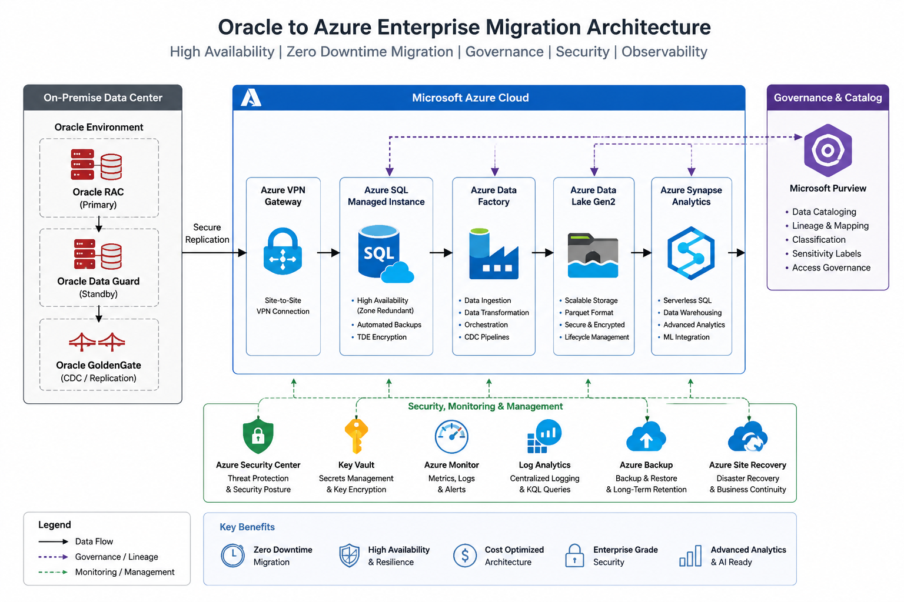

# Oracle to Azure Enterprise Migration Framework

Enterprise-grade reference architecture for migrating Oracle workloads to Microsoft Azure with high availability, governance, disaster recovery, and observability patterns.

---

# Enterprise Reference Architecture



---

# Overview

This repository demonstrates enterprise migration strategies for modernising Oracle environments into Azure-native data platforms while preserving:

- High Availability
- Security & Compliance
- Disaster Recovery
- Governance & Lineage
- Operational Continuity
- Enterprise Observability

---

# Architecture Components

## Source Environment
- Oracle RAC
- Oracle Data Guard
- Oracle GoldenGate
- Oracle Enterprise Manager

## Azure Platform
- Azure SQL Managed Instance
- Azure Data Factory
- Azure Data Lake Gen2
- Azure Synapse Analytics
- Microsoft Purview
- Azure Monitor

---

# Enterprise Migration Capabilities

| Capability | Description |
|---|---|
| Zero-Downtime Migration | Hybrid GoldenGate + ADF replication |
| Governance | Purview lineage and cataloguing |
| HA/DR | Failover groups and DR alignment |
| Monitoring | Azure Monitor + Log Analytics |
| CDC Pipelines | Incremental Oracle ingestion |
| Data Lake Integration | Synapse-ready analytics platform |

---

# Repository Structure

```text
architecture/
docs/
scripts/
